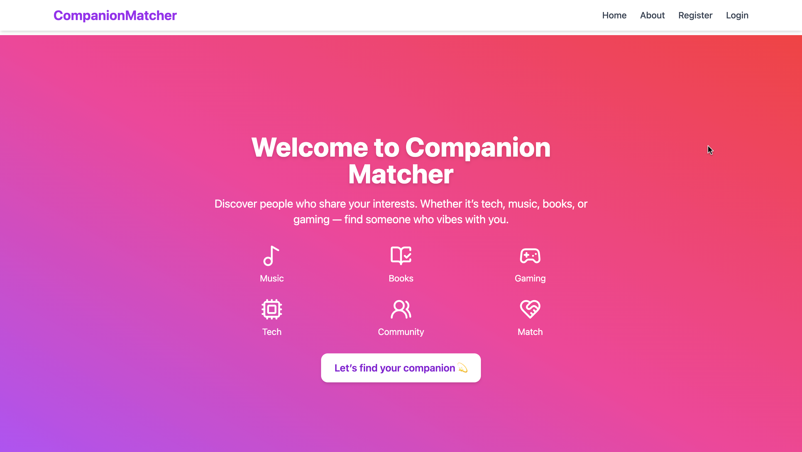
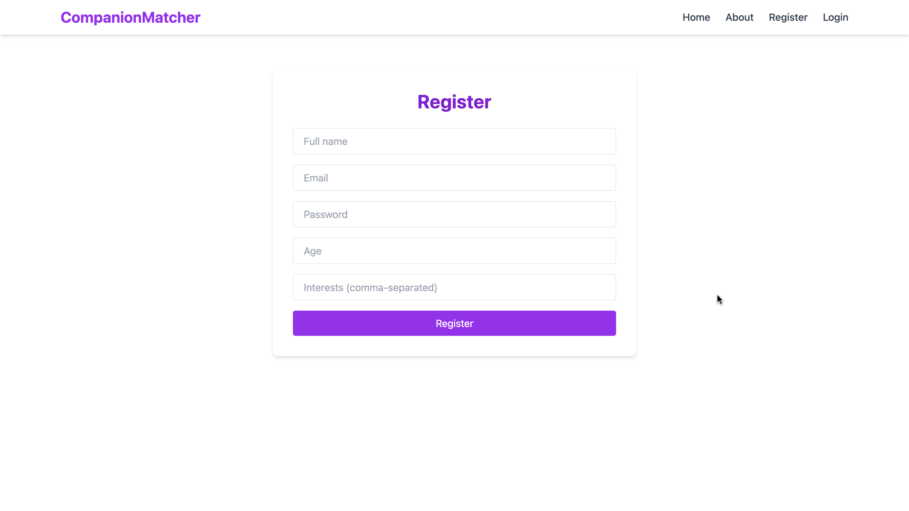
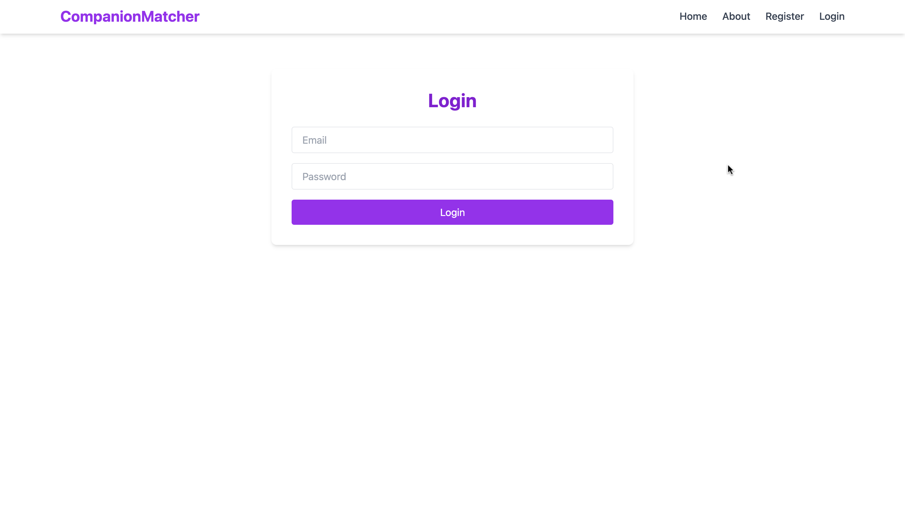
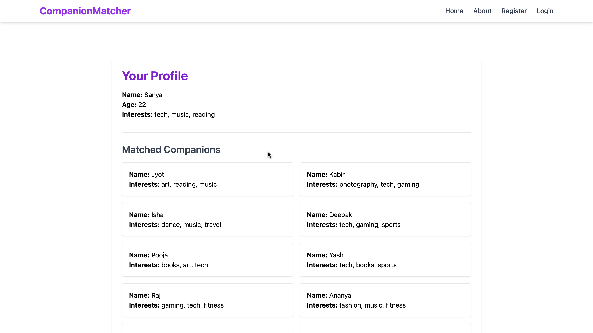
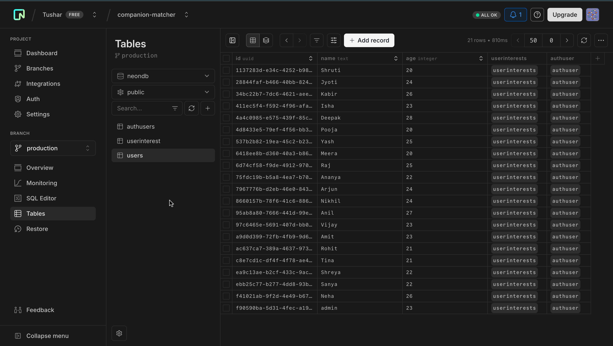

# Companion Matcher 💜

A full-stack web application that helps users find like-minded companions based on shared interests. Users can register, create profiles, and discover matches with at least two common interests.

---

## 🚀 How to Run the Application

### 🧱 Backend (Node.js + Express + PostgreSQL)

1. Clone the repo:
   ```bash
   git clone https://github.com/your-username/companion-matcher.git
   cd companion-matcher/backend
   ```

2. Install dependencies:
   ```bash
   npm install
   ```

3. Setup PostgreSQL:
   - Create a DB: `companion_matcher`
   - Run the schema setup:
     ```sql
     CREATE TABLE auth_users (
       id SERIAL PRIMARY KEY,
       username VARCHAR(50) UNIQUE NOT NULL,
       email VARCHAR(100) UNIQUE NOT NULL,
       password VARCHAR(100) NOT NULL,
       is_admin BOOLEAN DEFAULT FALSE
     );

     CREATE TABLE users (
       id SERIAL PRIMARY KEY,
       auth_user_id INTEGER REFERENCES auth_users(id) ON DELETE CASCADE,
       name VARCHAR(100),
       age INT,
       interests TEXT[]
     );

     CREATE TABLE shortlists (
       id SERIAL PRIMARY KEY,
       sender VARCHAR(50),
       receiver VARCHAR(50)
     );
     ```

4. Run backend:
   ```bash
   node index.js
   ```
   Backend runs on `http://localhost:5000`

---

### 🖥️ Frontend (React + Vite + Tailwind CSS)

1. Open a new terminal and go to frontend:
   ```bash
   cd ../frontend
   ```

2. Install dependencies:
   ```bash
   npm install
   ```

3. Start frontend:
   ```bash
   npm run dev
   ```
   Frontend runs on `http://localhost:5173`

---

## 🛠 Tech Stack Used

### 🌐 Frontend
- React with Vite
- Tailwind CSS v3
- React Router DOM
- Lucide Icons

### 🔗 Backend
- Node.js
- Express.js
- PostgreSQL
- Bcrypt (for password hashing)

---

## 📁 Folder Structure

```
companion-matcher/
├── backend/
│   ├── controllers/
│   ├── routes/
│   ├── data/
│   ├── config/
│   └── index.js
├── frontend/
│   ├── components/
│   ├── pages/
│   ├── App.jsx
│   └── main.jsx
```

---

## ✅ Features

- 🔐 User authentication (register/login)
- 🧑 Profile creation (name, age, interests)
- 🧠 Match suggestions based on shared interests
- 🛡 Admin access to all users
- 🎨 Responsive design with Tailwind CSS

---

## 📌 API Routes

### Authentication
- `POST /auth/register` → register with username, email, password, and profile data
- `POST /auth/login` → login with email & password

### Users
- `GET /users/:authUserId` → fetch logged-in user's profile
- `PUT /users/:authUserId` → update profile
- `DELETE /users/:authUserId` → delete profile
- `GET /users/matches/:username` → fetch companion matches
- `POST /users/shortlist` → shortlist a match
- `GET /users/shortlist/:username` → see who you shortlisted
- `GET /users/mutual/:username` → see mutual shortlists (real matches)

### Admin Utility
- `GET /users?auth_user_id=ADMIN_ID` → view all users (admin only)
- `GET /users/by-username/:username` → get user by username

---

## 📸 Project Screenshots

### 🏠 Home Page


### 🔐 Register Page


### 🔓 Login Page


### 👤 Profile + Matches


###  Postgres Database


---

## 🤝 Acknowledgments

Thanks to open-source tools like Tailwind, Lucide Icons, PostgreSQL, and the React community.

---

## 📫 Contact

Made with 💜 by Tushar Poddar
